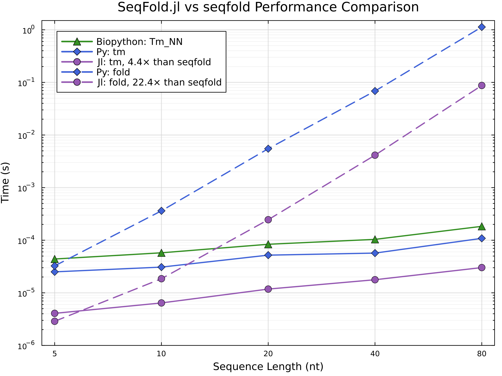

# SeqFold

```@meta
CurrentModule = SeqFold
```

## Introduction

[`SeqFold.jl`](https://github.com/phlaster/SeqFold.jl) is a high-performance Julia reimplementation of [`seqfold`](https://github.com/Lattice-Automation/seqfold) Python library for predicting nucleic acid secondary structures and calculating melting temperatures, which is, in turn, an implementation of the `Zuker, 1981` dynamic programming algorithm, the basis for [UNAFold/mfold](https://www.unafold.org/), with energy functions from `SantaLucia, 2004` (DNA) and `Turner, 2009` (RNA).

## Motivation

* Secondary structure prediction is essential for:
  - Designing PCR primers with minimal secondary structure;
  - Creating oligos for genome editing techniques like MAGE;
  - Tuning ribosome binding site (RBS) expression rates;
  - Analyzing potential off-target binding in CRISPR applications.

* While the Python `seqfold` library provides a minimalist open-source alternative to proprietary UNAFold/mfold, it has several limitations:
  - Performance bottlenecks in the pure Python implementation;
  - Undocumented bugs in melting temperature calculations;
  - Limited control over buffer conditions for $T_m$ calculations.

* `SeqFold.jl` addresses these issues, here are the key points:
  - For sequence folding the compatibility with the original `seqfold` library results is preserved (identical folding algorithm is used);
  - For accurate $T_m$ calculation buffer condition control is provided to user (physically impossible buffer conditions cause errors with meaningful error messages);
  - Results of $T_m$ calculation are validated against Biopython's reference implementation;
  - Significantly improved performance through Julia's JIT compilation. For oligs of 20 nt (a typical length for primer sequences) more than 4× speedup for `tm` and more than 20× speedup for `fold` is achieved:
    

## Installation

First option (inside Julia REPL):
```julia
julia> ]
pkg> add SeqFold
```
Second option (from Julia scripts):
```julia
using Pkg
Pkg.add("SeqFold")
```
either way you should now be able to call the package:
```julia
using SeqFold
```

```@docs
SeqFold
```

```@contents
```
